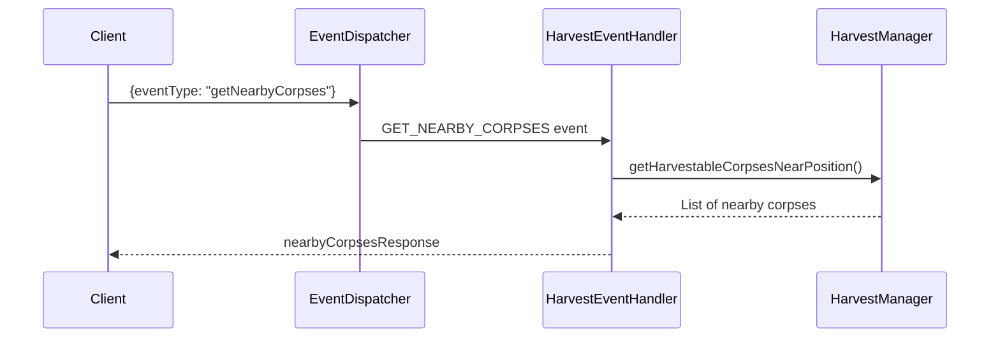
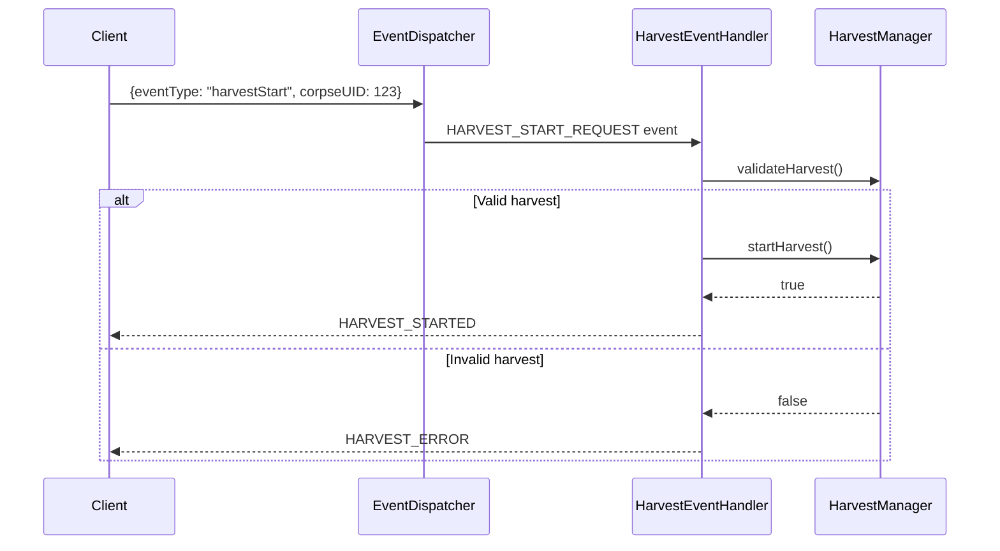
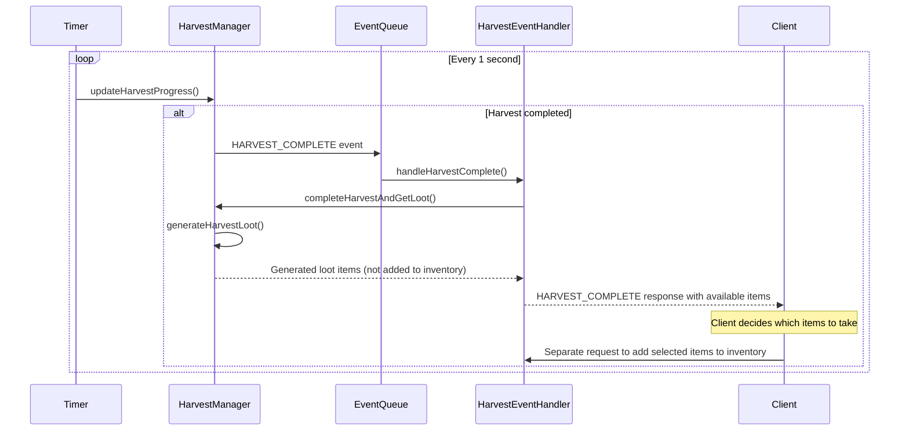

# Система Харвестинга (Harvest System) - Полная Документация

## Обзор

Система харвестинга позволяет игрокам собирать специальные ресурсы с трупов убитых мобов через интерактивный процесс. Это event-driven система реального времени, которая требует от игрока находиться рядом с трупом и проводить время для сбора специального лута, недоступного при обычном убийстве мобов.

## Архитектура

### Основные компоненты

#### 1. HarvestManager (`src/services/HarvestManager.cpp`)
- **Роль**: Центральный сервис управления системой харвестинга
- **Ответственность**:
  - Управление активными процессами харвестинга
  - Валидация условий харвестинга (расстояние, доступность трупа)
  - Генерация harvest-специфичного лута
  - Отслеживание прогресса харвестинга
  - Управление жизненным циклом трупов

#### 2. HarvestEventHandler (`src/events/handlers/HarvestEventHandler.cpp`)
- **Роль**: Обработчик событий от клиентов
- **Ответственность**:
  - Обработка запросов на начало харвестинга
  - Обработка запросов на отмену харвестинга
  - Обработка запросов на получение ближайших трупов
  - Отправка результатов харвестинга клиентам

#### 3. EventDispatcher (`src/events/EventDispatcher.cpp`)
- **Роль**: Диспетчер событий от клиента
- **Ответственность**:
  - Парсинг и валидация входящих сообщений от клиента
  - Преобразование клиентских событий в внутренние события системы

### Ключевые структуры данных

#### HarvestableCorpseStruct
```cpp
struct HarvestableCorpseStruct {
    int mobUID = 0;                                  // Уникальный UID умершего моба
    int mobId = 0;                                   // Template ID моба
    PositionStruct position;                         // Позиция трупа
    std::chrono::steady_clock::time_point deathTime; // Время смерти моба
    bool hasBeenHarvested = false;                   // Флаг: был ли труп уже собран
    int harvestedByCharacterId = 0;                  // ID персонажа, который собрал труп
    float interactionRadius = 150.0f;                // Радиус взаимодействия
};
```

#### HarvestRequestStruct
```cpp
struct HarvestRequestStruct {
    int characterId = 0; // Server-side ID персонажа из сессии
    int playerId = 0;    // Client-side ID игрока для верификации
    int corpseUID = 0;   // UID трупа для харвестинга
};
```

#### HarvestProgressStruct
```cpp
struct HarvestProgressStruct {
    int characterId = 0;
    int corpseUID = 0;
    std::chrono::steady_clock::time_point startTime;
    float harvestDuration = 3.0f; // Время харвестинга в секундах
    bool isActive = false;
    PositionStruct startPosition;  // Позиция начала харвестинга
    float maxMoveDistance = 50.0f; // Максимальное расстояние движения во время харвестинга
};
```

#### HarvestCompleteStruct
```cpp
struct HarvestCompleteStruct {
    int playerId = 0; // Игрок, завершивший харвестинг
    int corpseId = 0; // Труп, который был собран
};
```

## Флоу системы харвестинга

### 1. Регистрация трупа
Когда моб умирает, система автоматически регистрирует его труп для харвестинга:

```cpp
// В ItemEventHandler::handleMobLootGenerationEvent
gameServices_.getHarvestManager().registerCorpse(mobUID, mobId, position);
```

**Процесс:**
1. Моб умирает (событие `MOB_LOOT_GENERATION`)
2. Система создает обычный лут через `LootManager`
3. Труп регистрируется в `HarvestManager` как доступный для харвестинга
4. Труп содержит harvest-специфичные предметы (flagged `isHarvestOnly = true`)

### 2. Обнаружение ближайших трупов

**Инициатор:** Клиент  
**Событие:** `getNearbyCorpses`



### 3. Начало харвестинга

**Инициатор:** Клиент  
**Событие:** `harvestStart`



### 4. Прогресс и завершение харвестинга

**Автоматический процесс:**



## Пакеты данных (Client-Server Protocol)

### От клиента к серверу

#### 1. Получение ближайших трупов
```json
{
  "header": {
    "eventType": "getNearbyCorpses",
    "clientId": 12345,
    "hash": "client_hash"
  },
  "body": {}
}
```

#### 2. Начало харвестинга
```json
{
  "header": {
    "eventType": "harvestStart",
    "clientId": 12345,
    "hash": "client_hash"
  },
  "body": {
    "corpseUID": 67890
  }
}
```

#### 3. Отмена харвестинга
```json
{
  "header": {
    "eventType": "harvestCancel",
    "clientId": 12345,
    "hash": "client_hash"
  },
  "body": {}
}
```

### От сервера к клиенту

#### 1. Ответ со списком ближайших трупов
```json
{
  "status": "success",
  "data": {
    "header": {
      "message": "Nearby corpses retrieved",
      "clientId": "12345",
      "eventType": "nearbyCorpsesResponse"
    },
    "body": {
      "corpses": [
        {
          "id": 67890,
          "mobId": 15,
          "positionX": 1250.5,
          "positionY": 750.2,
          "hasBeenHarvested": false
        }
      ],
      "count": 1
    }
  }
}
```

#### 2. Успешное начало харвестинга
```json
{
  "status": "success",
  "data": {
    "header": {
      "message": "Harvest started successfully",
      "hash": "client_hash",
      "clientId": "12345",
      "eventType": "harvestStarted"
    },
    "body": {
      "type": "HARVEST_STARTED",
      "clientId": 12345,
      "playerId": 12345,
      "corpseId": 67890,
      "duration": 3000,
      "startTime": 1640995200000
    }
  }
}
```

#### 3. Ошибка харвестинга
```json
{
  "status": "error",
  "data": {
    "header": {
      "message": "Failed to start harvest",
      "hash": "client_hash",
      "clientId": "12345",
      "eventType": "harvestError"
    },
    "body": {
      "type": "HARVEST_ERROR",
      "clientId": 12345,
      "playerId": 12345,
      "corpseId": 67890,
      "errorCode": "CORPSE_NOT_AVAILABLE",
      "message": "Corpse not available for harvest"
    }
  }
}
```

#### 4. Завершение харвестинга
```json
{
  "status": "success",
  "data": {
    "header": {
      "message": "Harvest completed",
      "hash": "client_hash",
      "clientId": "12345",
      "eventType": "harvestComplete"
    },
    "body": {
      "type": "HARVEST_COMPLETE",
      "clientId": 12345,
      "playerId": 12345,
      "corpseId": 67890,
      "success": true,
      "totalItems": 2,
      "items": [
        {
          "itemId": 101,
          "quantity": 1,
          "name": "Wolf Pelt",
          "description": "High quality wolf pelt",
          "rarityId": 2,
          "rarityName": "Uncommon",
          "itemType": "Material",
          "weight": 0.5,
          "addedToInventory": false,
          "isHarvestItem": true
        },
        {
          "itemId": 102,
          "quantity": 2,
          "name": "Wolf Bone",
          "description": "Strong wolf bone",
          "rarityId": 1,
          "rarityName": "Common",
          "itemType": "Material",
          "weight": 0.2,
          "addedToInventory": false,
          "isHarvestItem": true
        }
      ]
    }
  }
}
```

#### 5. Добавление выбранных предметов в инвентарь

**Отдельный запрос от клиента после получения HARVEST_COMPLETE:**

```json
{
  "header": {
    "eventType": "takeHarvestItems",
    "clientId": 12345,
    "hash": "client_hash"
  },
  "body": {
    "corpseUID": 67890,
    "selectedItems": [
      {
        "itemId": 101,
        "quantity": 1
      },
      {
        "itemId": 102,
        "quantity": 1
      }
    ]
  }
}
```

**Ответ сервера:**
```json
{
  "status": "success",
  "data": {
    "header": {
      "message": "Items added to inventory",
      "hash": "client_hash",
      "clientId": "12345",
      "eventType": "harvestItemsTaken"
    },
    "body": {
      "type": "HARVEST_ITEMS_TAKEN",
      "corpseId": 67890,
      "addedItems": [
        {
          "itemId": 101,
          "quantity": 1,
          "addedToInventory": true
        },
        {
          "itemId": 102,
          "quantity": 1,
          "addedToInventory": true
        }
      ],
      "failedItems": []
    }
  }
}
```

#### 6. Отмена харвестинга
```json
{
  "status": "success",
  "data": {
    "header": {
      "message": "Harvest cancelled",
      "hash": "client_hash",
      "clientId": "12345",
      "eventType": "harvestCancelled"
    },
    "body": {
      "type": "HARVEST_CANCELLED",
      "clientId": 12345,
      "corpseId": 67890,
      "reason": "MANUAL_CANCEL"
    }
  }
}
```

## Валидация и ограничения

### Условия для начала харвестинга

1. **Существование трупа**: Труп должен существовать в системе
2. **Не был собран**: `hasBeenHarvested = false`
3. **Расстояние**: Игрок должен находиться в пределах `interactionRadius` (по умолчанию 150.0f единиц)
4. **Один харвест**: Игрок не может харвестить более одного трупа одновременно

### Условия для отмены харвестинга

1. **Движение игрока**: Если игрок отошел от начальной позиции более чем на `maxMoveDistance` (50.0f единиц)
2. **Ручная отмена**: Игрок может отменить харвестинг вручную
3. **Отключение**: При отключении игрока харвестинг автоматически отменяется

### Конфигурационные константы

```cpp
static constexpr float DEFAULT_HARVEST_DURATION = 3.0f;     // Время харвестинга (секунды)
static constexpr float DEFAULT_INTERACTION_RADIUS = 150.0f; // Радиус взаимодействия
static constexpr float DEFAULT_MAX_MOVE_DISTANCE = 50.0f;   // Максимальное движение во время харвестинга
```

## Генерация лута

### Harvest-специфичный лут

Система генерирует лут на основе `MobLootInfoStruct` с флагом `isHarvestOnly = true`:

```cpp
// В HarvestManager::generateHarvestLoot()
for (const auto &lootInfo : allLootInfo) {
    if (!lootInfo.isHarvestOnly)
        continue; // Пропускаем обычный лут
    
    // Роллим шанс дропа
    if (dis(randomGenerator_) <= lootInfo.dropChance) {
        int quantity = 1; // Пока всегда 1
        loot.emplace_back(lootInfo.itemId, quantity);
    }
}
```

### Взаимодействие с инвентарем

**Важно:** При завершении харвестинга предметы **НЕ добавляются автоматически** в инвентарь игрока. Вместо этого:

1. **Генерация лута**: Система генерирует список доступных для сбора предметов
2. **Отправка списка клиенту**: Клиент получает полный список сгенерированных предметов
3. **Выбор игрока**: Игрок решает, какие предметы забрать (все, некоторые или ни одного)
4. **Отдельный запрос**: Клиент отправляет отдельный запрос с выбранными предметами для добавления в инвентарь

```cpp
// В HarvestManager::generateHarvestLoot() - только генерация, без добавления в инвентарь
for (const auto &lootInfo : allLootInfo) {
    if (!lootInfo.isHarvestOnly)
        continue; // Пропускаем обычный лут
    
    // Роллим шанс дропа
    if (dis(randomGenerator_) <= lootInfo.dropChance) {
        int quantity = 1; // Пока всегда 1
        loot.emplace_back(lootInfo.itemId, quantity);
    }
}
// Возвращаем сгенерированный лут БЕЗ добавления в инвентарь
```

**Преимущества такого подхода:**
- Игрок может выбирать, какие предметы забрать
- Нет автоматического заполнения инвентаря
- Возможность оставить предметы для других игроков
- Больше контроля над управлением инвентарем

## Автоматическая очистка

### Очистка старых трупов
```cpp
// Каждые 10 минут
gameServices_.getHarvestManager().cleanupOldCorpses(600); // 10 минут
```

### Автоматическое обновление прогресса
```cpp
// Каждую секунду
gameServices_.getHarvestManager().updateHarvestProgress();
```

## Потокобезопасность

Система использует shared_mutex для обеспечения потокобезопасности:
- `corpsesMutex_` - для защиты `harvestableCorpses_`
- `harvestsMutex_` - для защиты `activeHarvests_`

## Логирование и отладка

Система обширно логирует свои действия:
- Регистрация трупов
- Начало/завершение/отмена харвестинга
- Ошибки валидации
- Генерацию лута

## Коды ошибок

| Код ошибки | Описание |
|------------|----------|
| `PLAYER_NOT_FOUND` | Игрок не найден в системе |
| `CORPSE_NOT_AVAILABLE` | Труп недоступен для харвестинга |
| `HARVEST_FAILED` | Общая ошибка начала харвестинга |
| `TOO_FAR_FROM_CORPSE` | Игрок слишком далеко от трупа |
| `CORPSE_ALREADY_HARVESTED` | Труп уже был собран |
| `ALREADY_HARVESTING` | Игрок уже харвестит другой труп |

## Интеграция с другими системами

### С системой мобов
- При смерти моба автоматически регистрируется труп
- Используется mobId для определения возможного лута

### С системой лута
- Harvest-лут настраивается через `MobLootInfoStruct` с флагом `isHarvestOnly`
- Интегрируется с `ItemManager` для получения информации о предметах

### С системой инвентаря
- Полученные предметы автоматически добавляются в инвентарь
- Проверяется возможность добавления предметов

### С системой позиционирования
- Проверка расстояний между игроком и трупом
- Отслеживание движения игрока во время харвестинга
